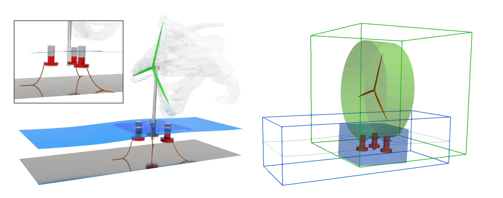

# multiPhysicsSWInterFoam
This repository provides a set of custom OpenFOAM solvers for coastal and ocean engineering applications.

It includes:
- **SWRiemannFoam**, a two-dimensional shallow water equation solver based on an approximate Riemann solver;
- **overInterDyMFoam+**, an extended three-dimensional Navier–Stokes solver with enhanced dynamic mesh and fluid–structure interaction capabilities;
- **multiPhysicsSWInterFoam**, a coupled multi-physics solver that integrates SWRiemannFoam and overInterDyMFoam+ to enable hybrid 2D–3D simulations.

Together, these solvers allow efficient modeling of large-scale wave propagation and localized, high-resolution flow interactions within a unified OpenFOAM framework.

# solvers
## SWRiemannFoam
SWRiemannFoam is a solver for the two-dimensional shallow water equations.

The solver is designed for simulating tsunami propagation and flood inundation problems,
and is intended for computing long-period waves such as tsunamis.

This solver was implemented based on the methodology presented in the following paper:

Murillo, J. and García-Navarro, P.,  
“Augmented versions of the HLL and HLLC Riemann solvers including source terms in one and two dimensions for shallow flow applications,”  
*Journal of Computational Physics*, Vol. 231, No. 20, pp. 6861–6906, 2012.  
https://www.sciencedirect.com/science/article/pii/S0021999112003464

  
  

## overInterDyMFoam+
overInterDyMFoam+ is a solver

Bullet Physics Engine: https://github.com/bulletphysics/bullet3

MoorDyn: https://github.com/FloatingArrayDesign/MoorDyn

  

## multiPhysicsSWInterFoam
multiPhysicsSWInterFoam is a custom multi-physics solver built on OpenFOAM for coastal and ocean engineering applications.

The solver enables flexible coupling between a two-dimensional shallow water equation (SWE) solver
and a three-dimensional Navier–Stokes (NS) solver, allowing the simultaneous simulation of
large-scale, long-period wave propagation and localized high-resolution flow interactions.

  

