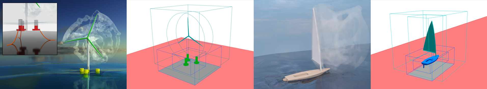
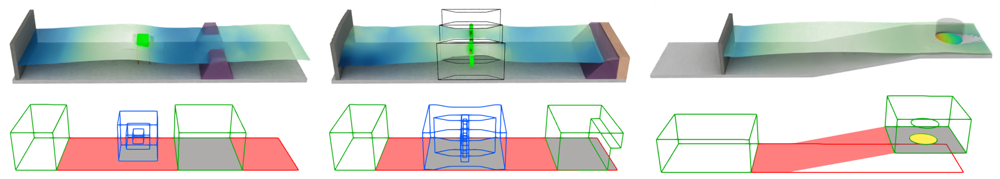
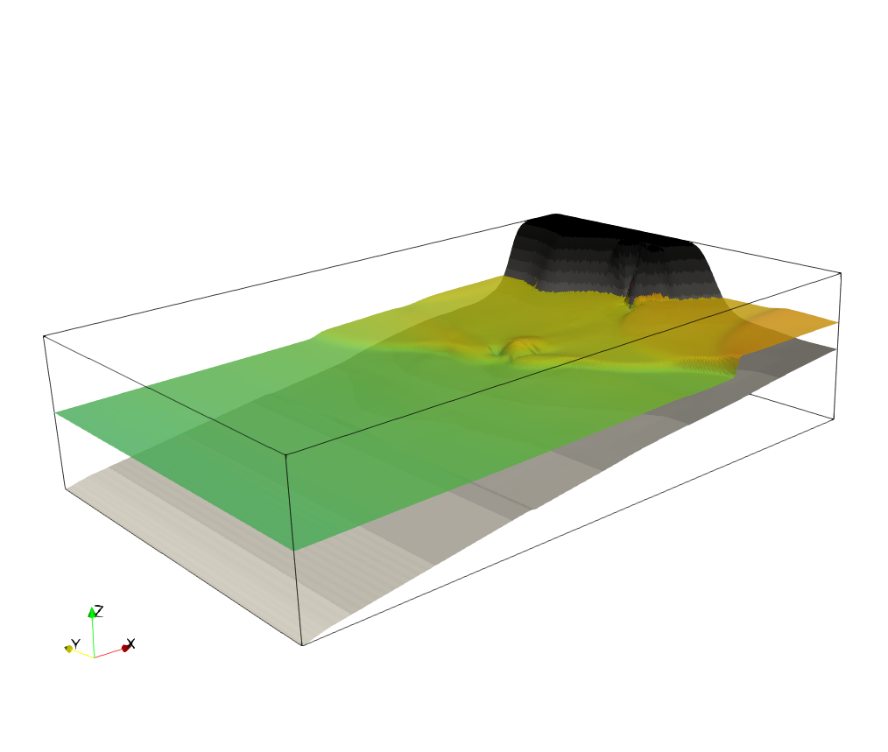

# multiPhysicsSWInterFoam
multiPhysicsSWInterFoam is a custom solver built on OpenFOAM, designed to address a wide range of engineering problems in coastal and ocean engineering.
It enables the flexible coupling of 2D shallow water equations (SWE) and 3D Navier–Stokes (NS) solvers, allowing for the simultaneous simulation of large-scale wave propagation and localized high-resolution interactions.

# solvers
## SWRiemannFoam
SWRiemannFoam is a solver for the two-dimensional shallow water equations.

The solver is designed for simulating tsunami propagation and flood inundation problems,
and is intended for computing long-period waves such as tsunamis.

This solver was implemented based on the methodology presented in the following paper:

Murillo, J. and García-Navarro, P.,  
“Augmented versions of the HLL and HLLC Riemann solvers including source terms in one and two dimensions for shallow flow applications,”  
*Journal of Computational Physics*, Vol. 231, No. 20, pp. 6861–6906, 2012.  
https://www.sciencedirect.com/science/article/pii/S0021999112003464

